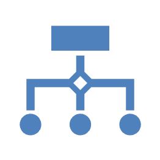

<h1 align="center">Agentics</h1>
<h2 align="center">Transduction is all you need</h1>
<p align="center">
    
    
</p>

Author: Alfio Massimiliano Gliozzo (gliozzo@us.ibm.com)


Agentics is a Python framework that provides structured, scalable, and semantically grounded agentic computation. It enables developers to build AI-powered pipelines where all operations are based on typed data transformations, combining the power of Pydantic models and LLMs with the flexibility of asynchronous execution.

## 🚀 Key Features

**Typed Agentic Computation**: Define workflows over structured types using standard Pydantic schemas.

**Logical Transduction (<<)**: Transform data between types using LLMs with few-shot examples, tools, and memory.

**Async Mapping and Reduction**: Apply async mapping (amap) and aggregation (areduce) functions over datasets.

**Batch Execution & Retry**: Automatically handles batch-based asynchronous execution with graceful fallback.

**Domain Customization**
- **Prompt Templates**  Customize prompting behavior and add ad-hoc instructions
- **Memory Augmentation**: Use retrieval-augmented memory to inform transduction.

**Built-in Support for Tools**: Integrate LangChain tools or custom functions.


## 🚀 Documentation

👉 [Getting Started](docs/getting_started.md): Learn how to install Agentic, set up your environment, and run your first logical transduction.

🧠 [Agentics](docs/agentics.md): Explore how Agentics wraps `pydantic` models into transduction-ready agents. 

🔁 [Transduction](docs/transduction.md): Discover how the `<<` operator implements logical transduction between types and how to control its behavior.

🧬 [Memory](docs/memory.md): Leverage external knowledge from documents to enhance transduction.

🛠️ [Tools](docs/tools.md): Learn how to integrate external tools (e.g., LangChain, CrewAI) to provide access to external data necessary for logical transduction.

## 📘 Example Usage
```python
from agentics import Agentics
from pydantic import BaseModel

class Answer(BaseModel):
    answer: str
    justification: str
    confidence: float

# Instantiate an Agentics object with a target type
qa_agent = Agentics(atype=Answer)

# Perform transduction from text prompts
qa_agent = await (qa_agent << [
    "Who is the president of the US?",
    "When is the end of the world predicted?",
    "This is a report from the US embassy"
]) 
```

# Access structured answers
for result in qa_agent.states:
    print(result.answer, result.confidence)

🧠 Conceptual Overview

Agentics models workflows as transformations between typed states. Each instance of Agentics includes:

atype: A Pydantic model representing the schema.

states: A list of objects of that type.

Optional llm, tools, prompt_template, memory, and batch_size.

Operations:

amap(func): Applies an async function over each state.

areduce(func): Reduces a list of states into a single value.

<<: Performs logical transduction from source to target Agentics.

🔧 Advanced Usage

Customizing Prompts

agent.prompt_template = """
You are an assistant that extracts key information.
Please respond using the format {answer}, {justification}, {confidence}.
"""

📚 Documentation

Full documentation and examples are available at:  

🧪 Tests

Run all tests using:

pytest tests/

🛠️ Requirements

Python 3.11+

pydantic >= 2.0

langchain, crewai 

📄 License

Apache 2.0

👥 Authors

Developed by Alfio Gliozzo and contributors. Contributions welcome!
