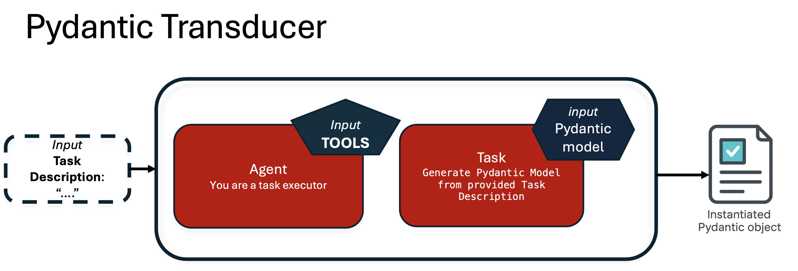

# Transduction

Agentics supports logical transduction between structured data types using the << operator, which overloads Python’s left shift (lshift) operator.

When applied between two Agentics objects, the << operator asynchronously performs type-driven transductions from the states of the right-hand Agentics to the type (atype) of the left-hand one.

⸻


## Logical Transduction

Logical Transduction is the **inference-driven transformation** of an object from one type to another, such that for all predicted slots it is possible to provide a logical explanation supported by input data and or contextual observations. The input object is called **source** and could be any Pydantic object or just input text. The output object is called **target** and is a pydantic object of the specified output type. 

Logical Transduction can be implemented by pydantic transducers, which rely on the use of agents to perform the necessary steps to perform logical transductions using the appropriate **tools** to gather information from *external world* as needed. 



Agentics V0.1 implements pydantic transduction internally by using a single task async [crew AI](https://www.crewai.com/) abstraction. 
Source code is self explanatory. [Pydantic Transducer Implementation](https://github.ibm.com/nl2insights/agentics/blob/main/src/agentics/abstractions/pydantic_transducer.py)

Alternative implementations will be provided when framework will mature.


## Transduction Operator (<<)

The << operator is defined only when the left operand is an Agentics object. It attempts to transform each item in the source Agentics (right operand) into a new object of the type defined by the left Agentics (atype), using LLM-based inference under the hood.

The example below transduces orders into notification emails.

```python
from pydantic import BaseModel, Field
from typing import Optional
import asyncio
from agentics import AG

class NotificationEmail(BaseModel):
    """Generate an email to notify the customer of an executed order"""
    customer_name: Optional[str] = Field(None, description="The name of the customer")
    subject: Optional[str] = Field(None, description="A concise subject for the email")
    message: Optional[str] = Field(None, description="Notification message about the transaction")
    order_details: Optional[str] = Field(None, description="Order details as a Markdown table")

async def main():
    notifications = AG.from_pydantic(NotificationEmail) << AG.from_csv("data/orders.csv", Order)
    notifications = await notifications
    return notifications.states

print(asyncio.run(main()))
```
⚠️ Note: Since << is asynchronous, it must be awaited, and your logic must run inside an async function using asyncio.run().

Optionally the second operator of a transduction operation could be provided as a list of strings, which will be considered by the pydantic transducer, enabling maximum flexibility for ad-hoch prompting strategies. 


```python
async def main():
    notifications = AG.from_pydantic(NotificationEmail) << ["Customer ID 323, Alfio Gliozzo, transferred $3000 to Customer ID 34", "..."]
    notifications = await notifications
    return notifications.states
```

## Customizing Transduction

### Instructions

To fine-tune the transduction process, you can attach instructions to the source Agentics. These instructions guide the transformation, offering semantic hints to the LLM.
```python
async def main():
    notifications = AG.from_pydantic(NotificationEmail)
    notifications.instructions = """Write an email to notify the customer of an order 
    execution provided as input. For example, include the customer name, a subject, 
    a message, and order details in a markdown table."""
    
    notifications_process = notifications << AG.from_csv("data/orders.csv", Order)
    notifications = await notifications_process
    return notifications.states
```
This enables highly customized behavior beyond default field-to-field mapping, making Agentics ideal for expressive, type-safe LLM applications

### Few Shots

### Tools

Agentics enhances logical transduction by incorporating tools—interfaces that bridge the internal reasoning of large language models (LLMs) with external resources. These tools enable interactions with APIs, databases, filesystems, and other structured data sources, facilitating dynamic and grounded outputs.

🔍 Example: Reading Documentation Files

Utilize the FileReadTool to extract structured information from documentation files.
[tool_example.py](src/agentics/examples/tool_example.py)

```python
from crewai_tools import FileReadTool
file_read_tool = FileReadTool()

class FileDescription(BaseModel):
    file_name: Optional[str] = None
    file_type: Optional[str] = None
    keywords: Optional[List[str]] = None

async def main():
    answers = AG(atype=FileDescription,
                tools=[file_read_tool])
    
    documentation_files = [os.path.abspath(os.path.join("docs", entry)) 
                            for entry in os.listdir("docs")]
    answers = answers << documentation_files
    return await answers
   
asyncio.run(main())
```

Capabilities Enabled by Tools
	•	Perform real-time data lookups
	•	Query SQL databases or knowledge graphs
	•	Invoke external APIs during transduction
	•	Validate or enrich outputs with external logic 

🤝 Framework Compatibility

Agentics does not define a proprietary tool system. Instead, it integrates seamlessly with the CrewAI tool ecosystem, ensuring flexibility and interoperability. Support for additional frameworks, such as LangGraph, is planned for future releases.

Tools are employed by Agentics’ Pydantic transducers (i.e., task-specific agents) to populate output fields. These are dynamically selected through the internal function-call mechanism utilized by the underlying LLM.

## Self Transduction

Agentics enable transduction to be done among two different sets of attributes within the same type. For example, the following code implement the same functionality of the simple QA transduction before, whereas instead of transducing two agentics of different types , it picks the target and source states from the existing states, and populate back the generated ones in the same object. 

```python

class QuestionAnsweringTask(BaseModel):
    question:Optional[str] = None
    answer: Optional[str] = None
    justification: Optional[str] = None

async def main():
    
    answers = AG.from_pydantic(QuestionAnsweringTask)
    answers.states.append(QuestionAnsweringTask(question="How many states in the US?"))
    answers.states.append(QuestionAnsweringTask(question="Who is the greatest philosopher of all times?"))
    answers = await answers.self_transduction(["question"],["answer","justification"])
    print(answers.states)

asyncio.run(main())
```
Self transduction is a very conveniente notation to handle state graphs in complex workflows, where different attributes of the same object can be manipulated by a mix transduction and conventional code. 
